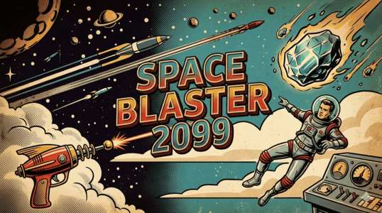
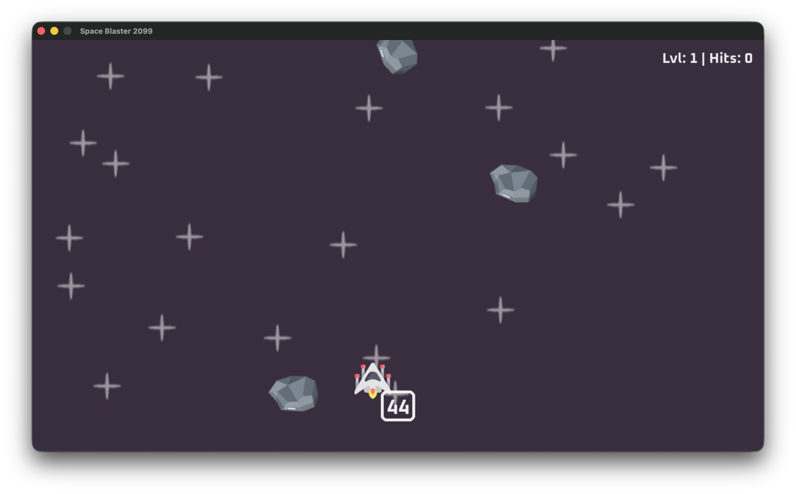
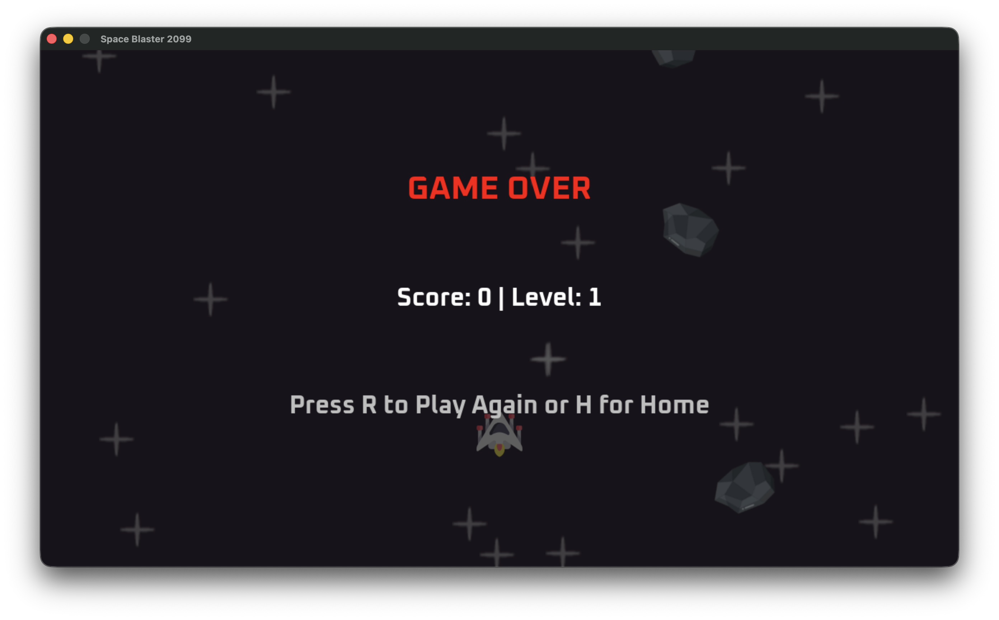

# SpaceBlaster 2099

### American International University-Bangladesh

### Course: Programming in Python

### Instructor: MD Tanzeem Rahat

---

## 💠 Team Members

| Name          | ID         | Email                                                         | GitHub                                            |
| ------------- | ---------- | ------------------------------------------------------------- | ------------------------------------------------- |
| Salman Sayeed | 22-49006-3 | [ss.salmansayeed@gmail.com](mailto:ss.salmansayeed@gmail.com) | [salman-sayeed](https://github.com/salman-sayeed) |
| Kayjer Islam  | 22-49005-3 | [kaizerislam577@gmail.com](mailto:kaizerislam577@gmail.com)   | [kayjer-islam](https://github.com/kayjer-islam)   |

---

## 💠 Setup & Installation

Follow these steps to run the project locally.

### 1. Clone the Repository

```bash
git clone https://github.com/salman-sayeed/python-midterm-project.git
cd src
```

### 2. Create Virtual Environment
#### Windows:
```bash
python -m venv .venv
```
#### MacOs/Linux:
```
python3 -m venv .venv
```

### 3. Activate Virtual Environment
#### Windows:
```bash
.venv\Scripts\activate
```
#### MacOs/Linux:
```
source .venv/bin/activate
```
### 4. Install Dependencies
```bash
pip install -r requirements.txt
```
### 5. Run the Game
```bash
python main.py //python3 main.py for mac
```

## 💠 Game Controls

| Key        | Action |
|------------|--------|
| Arrow Keys | Move spaceship |
| Spacebar   | Shoot laser |
| P          | Start game |
| R          | Restart game |
| H          | Return to home screen |
| Q          | Quit |


## 💠 Screenshots
###  Gameplay






## 💠 Notes
- Requires **Python 3.8 or higher**.
- Make sure all dependencies are installed using:
  ```bash
  pip install -r requirements.txt
  ```